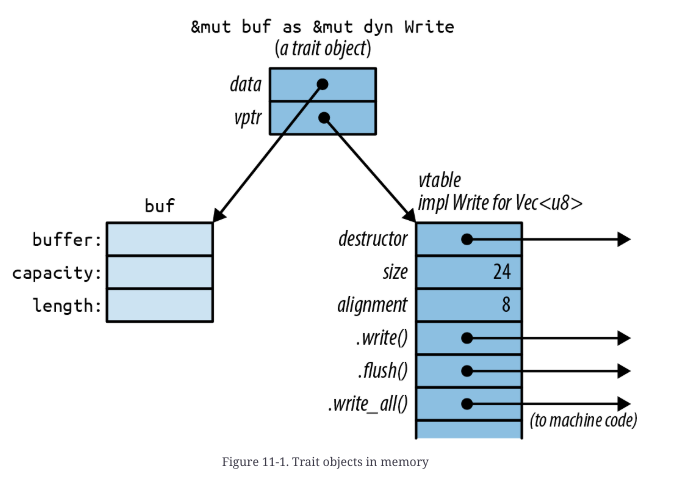

# Traits and Generics

- Rust takes a fresh approach inspired by Haskell's typeclasses
- We can use traits to add extension to existing types, event built-in types like `str` and `bool`

```rust 
/// Given two values, pick whichever one is less.
fn min<T: Ord>(value1: T, value2: T) -> T {
    if value1 <= value2 {
        value1
    } else {
        value2
    }
}
```

- compiler generates custom machine code for each type `T` that you actually use

## Traits

Rule

- the trait itself must be in the scope, otherwise, all its methods are hidden

```rust 
let mut buf: Vec<u8> = vec![];
buf.write_all(b"hello") ?;  // error: no method named `write_all`
```

-> this won't compile

```rust 
use std::io::Write;

let mut buf: Vec<u8> = vec![];
buf.write_all(b"hello") ?;  // ok
```

-> this now compiles

- If you import traits with same functions, there might be naming conflicts ... but you can solve it easily
- Standard prelude
    - carefully chosen selection of traits that rust automatically import -> you don't have to import for
      yourself

### Trait Objects

```rust 
use std::io::Write;

let mut buf: Vec<u8> = vec![];
let writer: dyn Write = buf;  // error: `Write` does not have a constant size
```

-> this is not allowed because the size of the `writer` object is not known at compile time

```rust 
let mut buf: Vec<u8> = vec![];
let writer: & mut dyn Write = & mut buf;  // ok
```

-> `writer` is called a trait object

### Trait Object Layout

Rust need type information of the trait object, where does it store then?


- `vtable` is generated once, at compile time, and shared by all objects of the same type

## Generic Functions and Type Parameters

```rust 
fn say_hello<W: Write>(out: &mut W) -> std::io::Result<()> {
    out.write_all(b"hello world\n")?;
    out.flush()
}
```

- `monomorphization`: when generics are used, rust compiler automatically generates code for each type.

```rust 
fn run_query<M, R>(data: &DataSet, map: M, reduce: R) -> Results
where
    M: Mapper + Serialize,
    R: Reducer + Serialize
{ ... }
```

- Declaring generics can become long, and as an alternative, rust provides `where` clause

```rust 

/// Return a reference to the point in `candidates` that's
/// closest to the `target` point.
fn nearest<'t, 'c, P>(target: &'t P, candidates: &'c [P]) -> &'c P
where
    P: MeasureDistance
{
    ...
}
```

- Generics can include lifetime parameters. They come first before the type.
- Lifetime never have any impact on the machine code. Even if `P` with different lifetime calls `nearest`
  function, it calls the same machine code

```rust 
fn dot_product<const N: usize>(a: [f64; N], b: [f64; N]) -> f64 {
    let mut sum = 0.;
    for i in 0..N {
        sum += a[i] * b[i];
    }
    sum
}

// Explicitly provide `3` as the value for `N`.
dot_product::<3 > ([0.2, 0.4, 0.6], [0., 0., 1.])

// Let Rust infer that `N` must be `2`.
dot_product([3., 4.], [ -5., 1.])
```

- wow... rust supports constant parameters in generics

## What to choose? Trait objects or Generic code?

```rust
struct Salad {
    veggies: Vec<Box<dyn Vegetable>>
}
```

- When you need to group multiple implementations -> trait object
- When you want to reduce the total amount of compiled code
    - When using generics, compiler creates code for each type and this can become large(code bloat)
    - Not a big constraint in these days

- Advantages of using generics
    - Speed: compiler knows exactly which function to call, no more dynamic dispatch(no runtime cost)

- Orphan rule:
    - When you implement a trait, <b>either the trait or the type must be new in the current crate</b>. This
      ensures that trait implementations are unique.
        - e.g. you are not allowed to `impl Write for u8` because both `Write` and `u8` is in std lib
        - if it's allowed, there might be multiple places where `impl Write for u8` exist and Rust wouldn't know
          which one to choose

## Traits that define relationships between types

- Traits can be useful where there are multiple types that have to work together. They can describe
  relationships between types.

```rust 
pub trait Iterator {
    type Item;

    fn next(&mut self) -> Option<Self::Item>;
    ...
}

// (code from the std::env standard library module)
impl Iterator for Args {
    type Item = String;

    fn next(&mut self) -> Option<String> {
        ...
    }
    ...
}

/// Loop over an iterator, storing the values in a new vector.
fn collect_into_vector<I: Iterator>(iter: I) -> Vec<I::Item> {
    let mut results = Vec::new();
    for value in iter {
        results.push(value);
    }
    results
}
```

- `type Item` is an associated type
    - each type that implements `Iterator` must specify what type of item it produces.

```rust 
fn dump<I>(iter: I)
where
    I: Iterator,
    I::Item: Debug
{
    ...
}
```

or 

```rust 
fn dump<I>(iter: I)
    where I: Iterator<Item=String>
{
    ...
}
```

- We can also add bounds to associated types 

```rust 
trait Float {
    const ZERO: Self;
    const ONE: Self;
}

impl Float for f32 {
    const ZERO: f32 = 0.0;
    const ONE: f32 = 1.0;
}

impl Float for f64 {
    const ZERO: f64 = 0.0;
    const ONE: f64 = 1.0;
}
```

- associated const also exists 

# Operator Overloading 

- You can make your own types support arithmetic and other operators by implementing few built-in traits -> operator overlading 

## `PartialEq`

- What is meaning of equal 
  - (1) if `x == y` then `y == x` 
  - (2) if `x == y` && `y == z` then `x == z` 
  - (3) `x == x` should always be true 
- In rust, `0.0 / 0.0 != 0.0 / 0.0`
  - `0.0 / 0.0` -> NaN -> the standard requires the following rules to be true: 
```rust 
assert!(f64::is_nan(0.0 / 0.0));
assert_eq!(0.0 / 0.0 == 0.0 / 0.0, false);
assert_eq!(0.0 / 0.0 != 0.0 / 0.0, true);  

/// any ordered comparison with a NaN value must return false 
assert_eq!(0.0 / 0.0 < 0.0 / 0.0, false);
assert_eq!(0.0 / 0.0 > 0.0 / 0.0, false);
assert_eq!(0.0 / 0.0 <= 0.0 / 0.0, false);
assert_eq!(0.0 / 0.0 >= 0.0 / 0.0, false);
```

- Because rust doesn't meet the 3rd rule, the trait is called `PartialEq`
- There is also `Eq` trait 

## `PartialOrd`

- ordered compatison of `<`, `>`, `<=`, `>=` 

```rust 
trait PartialOrd<Rhs = Self>: PartialEq<Rhs>
where
    Rhs: ?Sized,
{
    fn partial_cmp(&self, other: &Rhs) -> Option<Ordering>;

    fn lt(&self, other: &Rhs) -> bool { ... }
    fn le(&self, other: &Rhs) -> bool { ... }
    fn gt(&self, other: &Rhs) -> bool { ... }
    fn ge(&self, other: &Rhs) -> bool { ... }
}
```

- if `partial_cmp` returns `None` 
