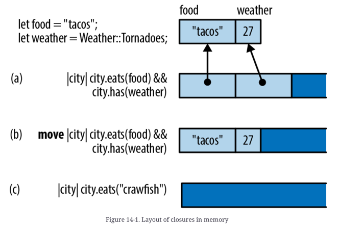
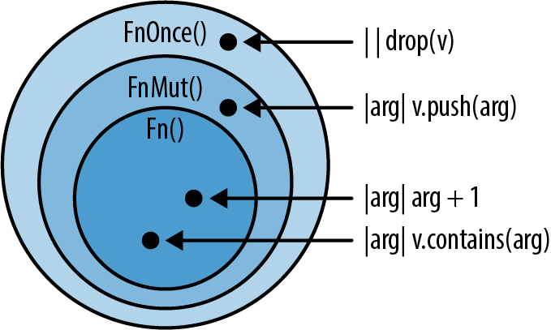

# Ownership and Moves 


# Traits and Generics

- Rust takes a fresh approach inspired by Haskell's typeclasses
- We can use traits to add extension to existing types, event built-in types like `str` and `bool`

```rust 
/// Given two values, pick whichever one is less.
fn min<T: Ord>(value1: T, value2: T) -> T {
    if value1 <= value2 {
        value1
    } else {
        value2
    }
}
```

- compiler generates custom machine code for each type `T` that you actually use

## Traits

Rule

- the trait itself must be in the scope, otherwise, all its methods are hidden

```rust 
let mut buf: Vec<u8> = vec![];
buf.write_all(b"hello") ?;  // error: no method named `write_all`
```

-> this won't compile

```rust 
use std::io::Write;

let mut buf: Vec<u8> = vec![];
buf.write_all(b"hello") ?;  // ok
```

-> this now compiles

- If you import traits with same functions, there might be naming conflicts ... but you can solve it easily
- Standard prelude
    - carefully chosen selection of traits that rust automatically import -> you don't have to import for
      yourself

### Trait Objects

```rust 
use std::io::Write;

let mut buf: Vec<u8> = vec![];
let writer: dyn Write = buf;  // error: `Write` does not have a constant size
```

-> this is not allowed because the size of the `writer` object is not known at compile time

```rust 
let mut buf: Vec<u8> = vec![];
let writer: & mut dyn Write = & mut buf;  // ok
```

-> `writer` is called a trait object

### Trait Object Layout

Rust need type information of the trait object, where does it store then?


- `vtable` is generated once, at compile time, and shared by all objects of the same type

## Generic Functions and Type Parameters

```rust 
fn say_hello<W: Write>(out: &mut W) -> std::io::Result<()> {
    out.write_all(b"hello world\n")?;
    out.flush()
}
```

- `monomorphization`: when generics are used, rust compiler automatically generates code for each type.

```rust 
fn run_query<M, R>(data: &DataSet, map: M, reduce: R) -> Results
where
    M: Mapper + Serialize,
    R: Reducer + Serialize
{ ... }
```

- Declaring generics can become long, and as an alternative, rust provides `where` clause

```rust 

/// Return a reference to the point in `candidates` that's
/// closest to the `target` point.
fn nearest<'t, 'c, P>(target: &'t P, candidates: &'c [P]) -> &'c P
where
    P: MeasureDistance
{
    ...
}
```

- Generics can include lifetime parameters. They come first before the type.
- Lifetime never have any impact on the machine code. Even if `P` with different lifetime calls `nearest`
  function, it calls the same machine code

```rust 
fn dot_product<const N: usize>(a: [f64; N], b: [f64; N]) -> f64 {
    let mut sum = 0.;
    for i in 0..N {
        sum += a[i] * b[i];
    }
    sum
}

// Explicitly provide `3` as the value for `N`.
dot_product::<3 > ([0.2, 0.4, 0.6], [0., 0., 1.])

// Let Rust infer that `N` must be `2`.
dot_product([3., 4.], [ -5., 1.])
```

- wow... rust supports constant parameters in generics

## What to choose? Trait objects or Generic code?

```rust
struct Salad {
    veggies: Vec<Box<dyn Vegetable>>
}
```

- When you need to group multiple implementations -> trait object
- When you want to reduce the total amount of compiled code
    - When using generics, compiler creates code for each type and this can become large(code bloat)
    - Not a big constraint in these days

- Advantages of using generics
    - Speed: compiler knows exactly which function to call, no more dynamic dispatch(no runtime cost)

- Orphan rule:
    - When you implement a trait, <b>either the trait or the type must be new in the current crate</b>. This
      ensures that trait implementations are unique.
        - e.g. you are not allowed to `impl Write for u8` because both `Write` and `u8` is in std lib
        - if it's allowed, there might be multiple places where `impl Write for u8` exist and Rust wouldn't know
          which one to choose

## Traits that define relationships between types

- Traits can be useful where there are multiple types that have to work together. They can describe
  relationships between types.

```rust 
pub trait Iterator {
    type Item;

    fn next(&mut self) -> Option<Self::Item>;
    ...
}

// (code from the std::env standard library module)
impl Iterator for Args {
    type Item = String;

    fn next(&mut self) -> Option<String> {
        ...
    }
    ...
}

/// Loop over an iterator, storing the values in a new vector.
fn collect_into_vector<I: Iterator>(iter: I) -> Vec<I::Item> {
    let mut results = Vec::new();
    for value in iter {
        results.push(value);
    }
    results
}
```

- `type Item` is an associated type
    - each type that implements `Iterator` must specify what type of item it produces.

```rust 
fn dump<I>(iter: I)
where
    I: Iterator,
    I::Item: Debug
{
    ...
}
```

or

```rust 
fn dump<I>(iter: I)
where
    I: Iterator<Item=String>
{
    ...
}
```

- We can also add bounds to associated types

```rust 
trait Float {
    const ZERO: Self;
    const ONE: Self;
}

impl Float for f32 {
    const ZERO: f32 = 0.0;
    const ONE: f32 = 1.0;
}

impl Float for f64 {
    const ZERO: f64 = 0.0;
    const ONE: f64 = 1.0;
}
```

- associated const also exists

# Operator Overloading

- You can make your own types support arithmetic and other operators by implementing few built-in traits ->
  operator overlading

## `PartialEq`

- What is meaning of equal
    - (1) if `x == y` then `y == x`
    - (2) if `x == y` && `y == z` then `x == z`
    - (3) `x == x` should always be true
- In rust, `0.0 / 0.0 != 0.0 / 0.0`
    - `0.0 / 0.0` -> NaN -> the standard requires the following rules to be true:

```rust 
assert!(f64::is_nan(0.0 / 0.0));
assert_eq!(0.0 / 0.0 == 0.0 / 0.0, false);
assert_eq!(0.0 / 0.0 != 0.0 / 0.0, true);

/// any ordered comparison with a NaN value must return false 
assert_eq!(0.0 / 0.0 < 0.0 / 0.0, false);
assert_eq!(0.0 / 0.0 > 0.0 / 0.0, false);
assert_eq!(0.0 / 0.0 <= 0.0 / 0.0, false);
assert_eq!(0.0 / 0.0 >= 0.0 / 0.0, false);
```

- Because rust doesn't meet the 3rd rule, the trait is called `PartialEq`
- There is also `Eq` trait

## `PartialOrd`

- ordered compatison of `<`, `>`, `<=`, `>=`

```rust 
trait PartialOrd<Rhs = Self>: PartialEq<Rhs>
where
    Rhs: ?Sized,
{
    fn partial_cmp(&self, other: &Rhs) -> Option<Ordering>;

    fn lt(&self, other: &Rhs) -> bool { ... }
    fn le(&self, other: &Rhs) -> bool { ... }
    fn gt(&self, other: &Rhs) -> bool { ... }
    fn ge(&self, other: &Rhs) -> bool { ... }
}
```

- if `partial_cmp` returns `None`

# Utility Traits

## Commonly used traits

- Language extension traits
    - `Drop`, `Deref`, `DerefMut`, `From`, `Into`
    - standard lib traits that serve as Rust extension language
- Marker traits
    - `Sized`, `Copy`
    - mostly used to bound generic type variables to express constraints
- Public vocab traits
    - don't have any magical compiler integration; but they serve the important goal of setting down
      conventional solutions for common problems
    - `Default`, `AsRef`, `AsMut`, `Borrow`, `BorrowMut`, `TryFrom`, `TryInto`, `ToOwned`, `Clone`

# Closures

Example

```rust
fn sort_cities(cities: &mut Vec<City>) {
    cities.sort_by_key(|city| -city.population);
} 
```

## Capturing Variables

- In garbage collected languages, variables captured by closures are usually stored in heap and garbage
  collected by the GC
- But rust doesn't have garbage collector... then how ?

### Closures that borrow

```rust 
/// Sort by any of several different statistics.
fn sort_by_statistic(cities: &mut Vec<City>, stat: Statistic) {
    cities.sort_by_key(|city| -city.get_statistic(stat));
}
```

- when rust creates the closure, it automatically borrows a reference to `stat`.
    - since the closure contains a reference to `stat`, Rust won't let it outlive `stat`
- Rust ensures by using lifetimes instead of garbage collection

### Closures that steal

```rust 
use std::thread;

fn start_sorting_thread(mut cities: Vec<City>, stat: Statistic) -> thread::JoinHandle<Vec<City>> {
    let key_fn = |city: &City| -> i64 { -city.get_statistic(stat) };

    thread::spawn(|| {
        cities.sort_by_key(key_fn);
        cities
    })
}
```

- Rust can't guarantee that the reference is used safely, therefore rejects the program

```shell 
error: closure may outlive the current function, but it borrows `stat`,
       which is owned by the current function
   |
33 | let key_fn = |city: &City| -> i64 { -city.get_statistic(stat) };
   |              ^^^^^^^^^^^^^^^^^^^^                       ^^^^
   |              |                                      `stat` is borrowed here
   |              may outlive borrowed value `stat`
```

- The solution is to tell Rust to `move` the `cities` and `stat` into the closures instead of borrowing
  references to them

```rust 
fn start_sorting_thread(mut cities: Vec<City>, stat: Statistic)
                        -> thread::JoinHandle<Vec<City>>
{
    // takes ownership of the stat 
    let key_fn = move |city: &City| -> i64 { -city.get_statistic(stat) };

    // take ownership of the cities and key_fn 
    thread::spawn(move || {
        cities.sort_by_key(key_fn);
        cities
    })
}
```

- closures follow the same rules about moves and borrowing

```rust
fn count_selected_cities<F>(cities: &Vec<City>, test_fn: F) -> usize
where
    F: Fn(&City) -> bool
{
    let mut count = 0;
    for city in cities {
        if test_fn(city) {
            count += 1;
        }
    }
    count
}
```

- in order to pass closures as arguments, you have to use `Fn`

```text
fn(&City) -> bool    // fn type (functions only)
Fn(&City) -> bool    // Fn trait (both functions and closures)
```

- every closure you write has its own type, because a closure may contain data: values either borrowed or stolen
  from enclosing scopes
- no two closures have exactly same type, but every closure implements an `Fn` trait

## Closure Performance

- In most languages, closures are allocated in the heap, dynamically dispatched and garbage collected
    - worse, closures tend to rule out inlining, a key technique compilers use to eliminate function call
      overhead
- Rust closures
    - not garbage collected
    - aren't allocated on the heap unless you use `Box`, `Vec` or other container
    - because Rust compiler knows the type of the closure you're calling, it can inline the code for that
      particular closure

### Layout of closures



- (a) borrows(references)
- (b) `move`s into the closure
- doesn't use any variables from its environment

## Closures and Safety

- What happens when a closure drops or modifies a captured value ?

### Closures that kill

```rust 
let my_str = "hello".to_string();
let f = | | drop(my_str);

f();  // ok
f();  // error: use of moved value
```

- What if we call `f()` twice?
    - Rust knows that this closure can't be called twice
    - It's unusual that closures can be called only once, but we know how to respect rust's safety guarantees

```rust 
fn call_twice<F>(closure: F) where
    F: Fn()
{
    closure();
    closure();
}

let my_str = "hello".to_string();
let f = | | drop(my_str);
call_twice(f);
```

```shell 
error: expected a closure that implements the `Fn` trait, but
       this closure only implements `FnOnce`
    |
  8 | let f = || drop(my_str);
    |         ^^^^^^^^------^
    |         |       |
    |         |       closure is `FnOnce` because it moves the variable `my_str`
    |         |       out of its environment
    |         this closure implements `FnOnce`, not `Fn`
  9 | call_twice(f);
    | ---------- the requirement to implement `Fn` derives from here
```

- Closures that drop values like `f`, are not allowed to have `Fn`
    - they implement a less powerful trait, `FnOnce`

### `Fn`, `FnOnce`, `FnMut`

```rust 
// Pseudocode for `Fn`, `FnMut`, and `FnOnce` traits.
trait Fn() -> R {
fn call(&self) -> R;
}

trait FnMut() -> R {
fn call_mut(&mut self) -> R;
}

trait FnOnce() -> R {
fn call_once(self) -> R;
}
```



- function trait types
    - `Fn`: the family of closures and functions that you can call multiple times without restriction.
    - `FnMut`: the family of closures that can be called multiple times if the closure itself is declared `mut`
    - `FnOnce`: the family of closures that can be called once, if the caller owns the closure


- closure that writes
- any closure that requires `mut` access to a value, but doesn't drop any values, is an `FnMut` closure

### Copy and Clone for Closures

- Because rust automatically figures out which closures can be called only once, it can figure out which
  closures can implement `Copy` and `Clone, and which cannot
- Closures are represented as structs that contain either the values(for `move` closures) or references to the
  values(for non-`move` closures)
  - A non-`move` closure that doesn't mutate variables hold only shared references, which are both `Clone` and `Copy` 
  - A non-`move` closure that does mutate values has mutable references within its internal representation. Mutable references are neither `Clone` nor `Copy` 
  - A `move` closure, the rules are even simpler. If everything a `move` closure captures is `Copy`, it's `Copy`. If everything it captures is `Clone`, it's `Clone`
```rust 
let y = 10;
let add_y = |x| x + y;
let copy_of_add_y = add_y;                // This closure is `Copy`, so...
assert_eq!(add_y(copy_of_add_y(22)), 42); // ... we can call both.
```

```rust 
let mut x = 0;
let mut add_to_x = |n| { x += n; x };

let copy_of_add_to_x = add_to_x;         // this moves, rather than copies
assert_eq!(add_to_x(copy_of_add_to_x(1)), 2); // error: use of moved value
```

```rust 
let mut greeting = String::from("Hello, ");
let greet = move |name| {
    greeting.push_str(name);
    println!("{}", greeting);
};
greet.clone()("Alfred");
greet.clone()("Bruce");
```

### Examples 

```rust 
App::new()
    .route("/", web::get().to(|| {
        HttpResponse::Ok()
            .content_type("text/html")
            .body("<title>GCD Calculator</title>...")
    }))
    .route("/gcd", web::post().to(|form: web::Form<GcdParameters>| {
        HttpResponse::Ok()
            .content_type("text/html")
            .body(format!("The GCD of {} and {} is {}.",
                          form.n, form.m, gcd(form.n, form.m)))
    }))
```

-> this is because `actix-web` has written to accept any thread-safe `Fn` as an argument 
