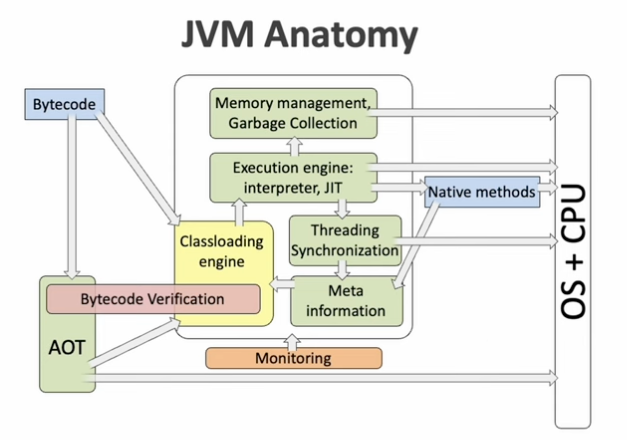

## [JVM Anatomy 101](https://www.youtube.com/watch?v=BeMi8K0AFAc&t=3048s)

### Java class file and bytecode

Java bytecode

- Contains
    - Instruction array
    - Operand stack
    - Local variables array(method arguments, local variables)
- An instruction pops its operands from the operand stack and pushes the result back to the stack
    - Btw, JVM is stack based VM
- JVM specification has very strict instruction spec

Java Runtime

- JVM alone is not sufficient to run java programs
- In order to run java programs, we need
    - JVM
    - Platform classes
        - core classes (Object, String etc)
        - Java standard APIs(IO, NET, NIO, AWT/Swing etc)
    - Implementation of native methods of platform classes(OS specific, distributed as native dynamic libraries
      e.g) .ddl, .so, .dylib)
    - Auxiliary files(time zones, locales descriptions, media resources etc)

### Classloading engine

- JVM executes classes from the following sources
    - Java runtime(platform classes)
    - Application classpath
    - Auto generated on-the-fly(proxy, reflection accessors, invoke dynamic implementation)
    - Provided by the application itself
- Classloader
    - every class is loaded by a class loader
    - types
        - platform classes are loaded by the bootstrap class loader
        - classes from application classpath are loaded by the system class loader (AppClassLoader)
        - application classes may create user defined class loaders
- JVM can load multiple classes with same fully qualified class name if they are using different class loaders
    - a class loader forms a unique class name space
- Class loading process
    - Class file parsing
        - format is checked on correctness(may throw `ClassFormatError`)
    - Creation of a runtime representation of the class in a special JVM memory area
        - method area(meta space, permanent generation)
    - Loading of a superclass and superinterfaces
    - Linking
        - Java bytecode verification
            - performed once for a class
            - instructions correctness checks(correctness of branches)
            - operand stack and local, variables out of bounds checks
            - type assign compatibility checks
        - Preparation
        - Resolution of symbolic references
    - Class initialization
        - call the static initializers
        - happens on first use:
            - new
            - static field access
            - static method call

### Execution engine: interpreters, JIT, AOT

- This kind of interpreters are very slow

- But still, java bytecode runs slowly
- Converting bytecode into native code will run faster

- Compilers
    - Non-optimization: make it up as I go along
    - Simple optimization: HotSpot Client(C1)
    - Sophisticated optimization: HotSpot Server(C2)

- Types of Compilers
    - Dynamic: JIT(Just-In-Time), translation into native code happens at application runtime
        - compiles hot code only
        - hot code is determined by means of profiling
    - Static: AOT(Ahead-Of-Time), translation happens before program execution
        - are not limited in resource for optimization
        - compile every method of a program using the most aggressive optimizations
        - no overheads at run-time(fast startup)
        - no bytecode will be executed at runtime
        - "Write once, run everywhere" doesn't work anymore

### Meta information access subsystem: reflection, indy, JNI

- Reflection
    - allow access to classes, fields, methods via name from a Java program
    - implemented in the JVM via access to meta space
- Method handles and invokedynamic
    - Indy: programmable call
        - for effective implementations of dynamic programming languages on the JVM
        - used for lambda object creation, string concatenation
    - MethodHandle - target object of invokedynamic call
        - can be access to a field, a method
        - combination fo other MethodHandles
        - can be used independently of indy: Reflection 2.0
- JNI
    - binds the JVM with the outside world(OS)
    - C interface to the JVM
        - does not depend on implementation details of a JVM
        - is used for implementation of native methods in C language(or another low-level language)
        - JNI is used to implement platform specific parts of Java SE API: IO, NET, AWT
    - JNI is implemented in the JVM as access to meta space
- Project Panama
    - C interop without coding in C
    - Direct external C functions calls from Java
    - C data structures access from Java

### Threading, exception handling, synchronization

- Thread
    - mapped to OS thread in 1:1
    - each thread has a reserved region of memory referred to as its stack containing local variables and
      operand stacks of methods(method frames) being executed within a thread
    - has detailed information about its stack(stack trace)
    - expensive thread creation -> virtual thread(managed by the JVM itself)

- compilers may optimize the above code
    - the order of execution might be reordered
- how to prevent this problem?
    - `volatile` -> memory barriers
- Synchronization
    - for safe access to a shared memory
    - Naive implementation may also use OS synchronization primitives
        - Java object has an OS monitor as a hidden field
    - highly optimized when a resource contention happens less rarely then an enter to a synchronized block
    - use `java.util.concurrent` instead

### Memory management: heap, allocation, GC

- Memory allocation
    - implementation of the `new` operator
    - Java heap structure is JVM implementation specific
    - Java objects layout is JVM implementation specific
    - Must be fast
        - JVM queries OS for memory for many objects at once, not per object
        - Allocation by bump the pointer technique
    - Must be thread safe but parallel
        - thread local heaps: every thread consumes thread local memory region
- Java object layout
    - not specified in JVM specification
    - requires
        - object header
            - reference to a class object
            - monitor
            - identity hashcode
            - GC flags
        - fields
            - may be reordered in sake of optimization, alignment, or target architecture specifics
    - Project Lilliput 
      - shrinking object headers 
    - Project Valhala 
      - the main idea is to introduce the concept of objects in the JVM, which don't require a header at all 
      - object erasure to its primitive types data 
      - removing unnecessary indirection in arrays  
- Garbage collection
  - What is garbage?
    - Simple reference counting doesn't work, what happen when there are cycles? 
    - Objects not reachable from the GC roots 
    - live objects 
      - objects from GC roots 
      - objects that are referenced by live objects 
    - GC roots 
      - objects in static fields
      - objects that are accessible from threads stacks 
      - objects that are referenced by JNI references in native methods 
  - Types 
    - mark and seep 
    - mark and copy 
      - heap is divided into 2 semi-spaces 
      - copies live objects to the second semi-space 
      - first semi-space is used as a second semi-space on the next collection
  - Stop tye world
    - when determining garbage 
    - how to reduce STW ? 
      - incremental 
        - do not collect all the garbage within GC pause 
      - parallel 
        - collect the garbage  in parallel threads within GC pause 
      - concurrent 
        - collect the garbage concurrently with program execution 
  - Generational garbage collection 
    - weak generational hypothesis 
      - most objects die young 
      - old objects rarely reference young objects 

### Manageability and Monitoring

- JVM tool interface 
  - debuggers 
- profilers 
- Java Management Beans 
  - realtime monitoring tools 
    - JConsole, JMX console, AMC 
    - Visual VM 
    - Java Mission Control 

### JVM evolution directions

- 

## Related Videos

- [Java 9 Modules: The Duke Yet Lives That OSGI Shall Depose](https://vimeo.com/233822684)
- [Escaping the Jar Hell With Jigsaw Layers](https://www.youtube.com/watch?v=UXlASXkMeN0)
- [HotSpot Debugging at the OS Level](https://www.youtube.com/watch?v=JZpEskA_89U)
- [Devoxx Ukraine 2019: The Sea of Nodes and the HotSpot JIT - Cliff Click](https://www.youtube.com/watch?v=98lt45Aj8mo)
- [Nikita Lipsky - JIT vs. AOT: Unity And Conflict of Dynamic and Static Compilers for Java](https://www.youtube.com/watch?v=nzKqdxL8EXY)
- [GeeCON 2018: Aleksey Shipilëv - Java 메모리 모델 학습 취소 경험](https://www.youtube.com/results?search_query=java+memory+model+unlearning+experience)
- [The Faster Java Objects](https://www.youtube.com/watch?v=bZuPTCaciLU)
- [Roman Kennke — Project Lilliput: Shrinking object headers in the Hotspot JVM](https://www.youtube.com/watch?v=kbjZos2nUTo)