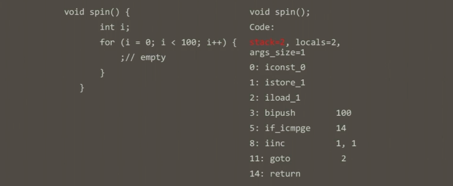
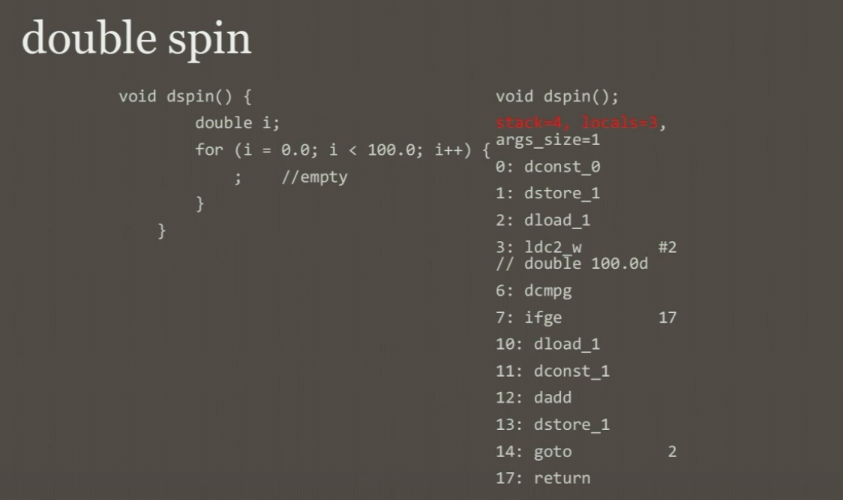
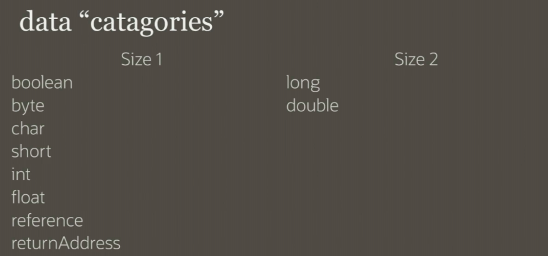
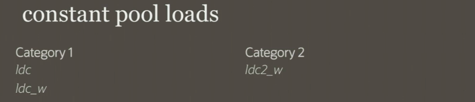

# Java Bytecode Crash Course 

- Why learn Java bytecode? 
  - foundation of Java language 
  - more expressive in compared to java language
  - sometimes you have to look into bytecode
  - foundation for future study 
    - bridge methods 
    - type eraser 
    - debugging 
  - it's fun(?) 

## What is bytecode 

- byte-sized opcodes 
  - only 256 possible opcodes 
  - this is why java is very conservative on adding new bytecode 
- operands(arguments for the opcodes) can be 8 or 16 bit 

## stack machine 

- bytecode runs on a stack machine 
  - it's convenient 
  - it's abstract away CPU register details 
  - free liveness analysis 

## local variables 

- independent of the stack 
- store / load commands 
- used to access method arguments 

### integer spin 

- `stack=2, locals=2, args_size=1`
  - `stack=2`: 2 element high stack(0 ~ 2, never go beyond 3)
  - `locals=2`: number of local variable slots 
  - `args_size=1`: number of arguments 
- `iconst_0`: push (integer) 0 to stack 
- `istore_1`: store the pushed integer(which is 0 in this case) to the local variable slot(index 1)
- `iload_1`: load the value back to the stack from the local variable slot 
- `bipush 100`: push the byte value 100 onto the stack 
- `if_icmge 14`: jump to 14 when condition is met(compare 0 and 100 which was on the stack)
- `iinc`: increment integer of the slot(locals) 1
- `goto 2`: goto bytecode line number 2 

### double spin 

- long and double require 2 slots for computation 
- it doesn't care whether you run java on 32 bit or 64 bit machine

- `ldc2_w`: load constant to w(from constant pool)

- category 1: everything which isn't double or float 
- category 2: for double or float 
