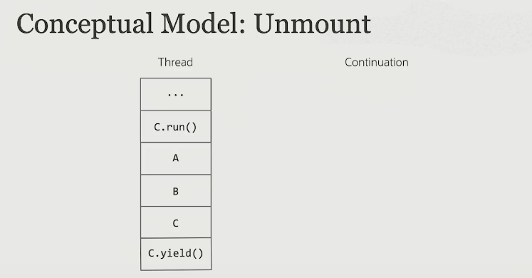
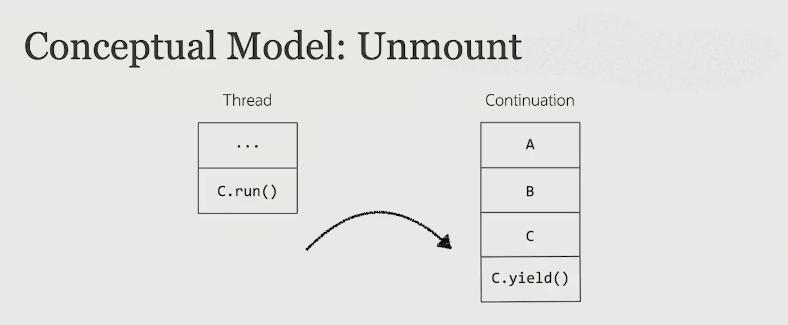
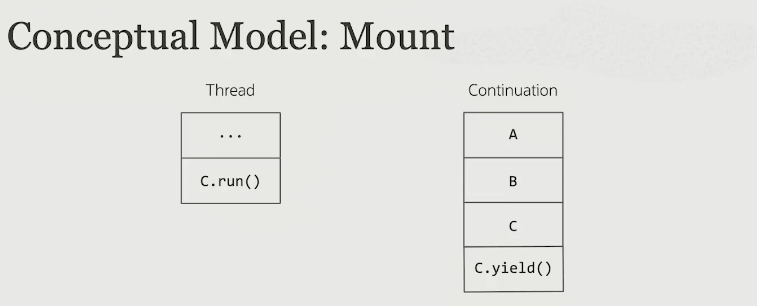
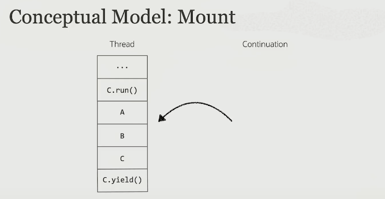
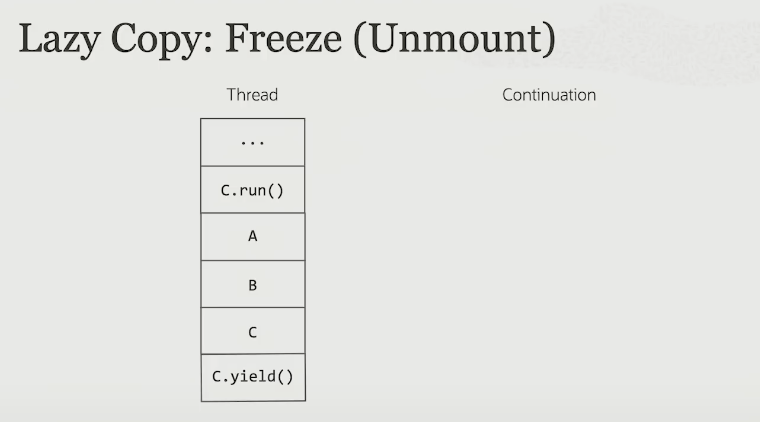
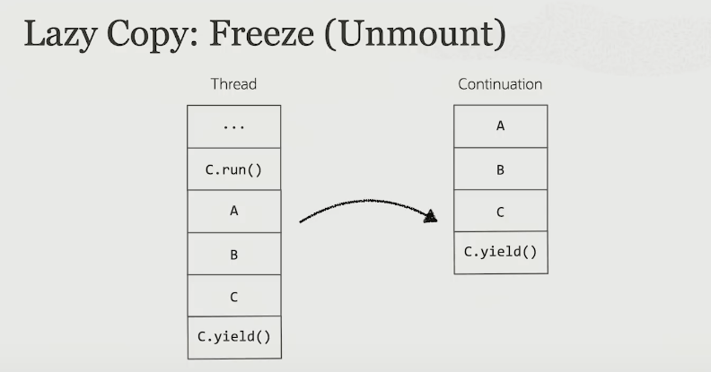
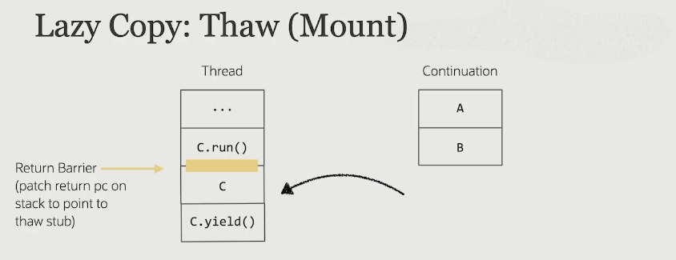

# [Continuation under the covers](https://www.youtube.com/watch?v=6nRS6UiN7X0) 

- Thread = Continuation + scheduler 
  - scheduler is implemented in java and core libraries 
  - continuation is implemented in VM

## Continuation 

```java 
class Continuation implements Runnable { 
    public Continuation(ContinuationScope scope, Runnable body); 
    
    // starts or resumes the continuation 
    public void run(); 
    
    public boolean isDone(); 
    
    // suspend the continuation 
    public static void yield(ContinuationScope scope); 
}
```

```java
Continuation cont = new Continuation(SCOPE, () -> {
    System.out.println("before");
    Continuation.yield(SCOPE);
    System.out.println("after"); 
}); 

cont.run(); // prints before 
cont.isDone(); // false 
cont.run(); // prints after 
cont.isDone(); // true 
```

### Terminology 

- Mounted: currently running on a thread(the virtual thread's carrier)
- Unmounted: suspended; not tied to any thread(blocked on I/O, synchronization or timed sleep)

### LockSupport 

```java
package java.util.concurrent.locks; 

public class LockSupport { 
    public static void park(...) { 
        var t = Thread.currentThread(); 
        if (t.isVirtual()) {
            Continuation.yield(THREAD_SCOPE);
        } else {
            Unsafe.park(false, 0L);
        }
    }
    
    public static void unpark(Thread thread) {
      if (thread.isVirtual()) {
        t.scheduler.submit(t.continuation); 
      } else {
        Unsafe.unpark(thread); 
      }
    }
}
```

### Simple Mental model for Mount/Unmount works? 

- Terminologies 
  - Freeze: suspend a continuation and unmount it by copying frames from OS thread stack to continuation object 
  - Thaw: mount a suspended continuation by copying frames from continuation object to OS thread stack 


- While continuation is running, frames are added to the thread 


- when `yield` is called, put the frames into Continuation


- when `continuation.run()` is called, move all the frames back to thread's stack 



- The pros/cons of this approach is(copying)... 
  - pros 
    - no change to compilers/interpreter; same frame layout, same stack-banging 
    - no change for native calls 
    - allocation only at yield, not arbitrary calls 
  - cons 
    - cost is O(continuation stack depth)
- To solve this problem, use lazy copy 

### Lazy Copy 






- we don't copy everything back to the thread stack 
- use return barrier 

- pros 
  - all execution is on the thread stack 
  - no change to compilers/interpreter; same frame layout, same stack-banging 
  - no change for native calls 
  - allocation only at yield, not arbitrary calls 
- cons 
  - not anymore, we only use computational cost of "stack used in current mounted session"

### Constraints 

- Stack frames contain references(oops - ordinary object pointers) and so must be managed by GC; might as well be in heap 
- A lot of data can be stored in so many stacks; must not be GC roots 
  - remember that we can have millions of virtual threads! You don't want to STW for scanning virtual thread stacks 
- Oop location must be stable 
  - direct representation is hard 

### Representation of an Continuation

... I think I need more base knowledge to understand 
