# [AWS re:Invent 2023 - Dive deep on Amazon S3 (STG314)](https://www.youtube.com/watch?v=sYDJYqvNeXU&list=WL&index=3)

- Reactive -> Threat modeling -> Proactive 

## Threat Modeling 
 
- Write a lot of docs 
- Threat reviews 
  - Actual written document 
  - Interactive working meeting 
  - Review with experienced team members 
  - Learning opportunity for junior engineers 

## What is S3 

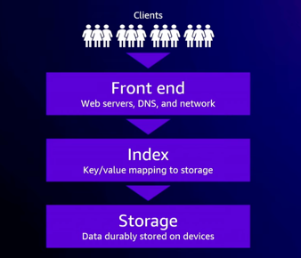

### S3 front end is big 

- 1PB/sec 
- The treat of scale and going wide 
  - Mechanisms for mitigation 
    - Use multipart upload to parallelize puts 
      - 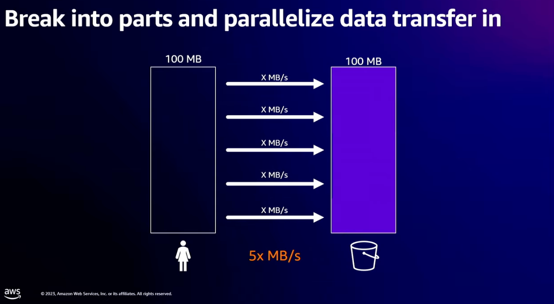
      - 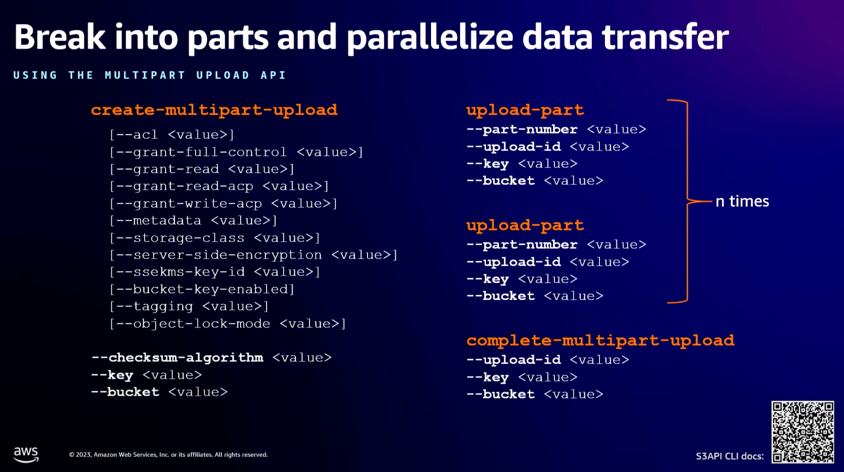
    - Use ranges to parallelize gets 
      - 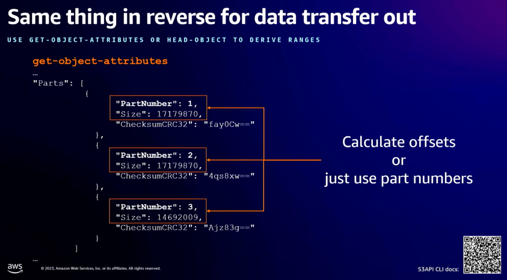
    - Spread requests across many IPs in the fleet 
      - 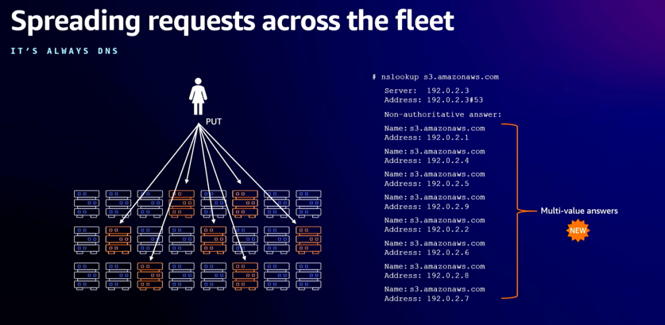

### S3 Index is big 

- 350 trillion objects 
  - it's constantly growing  

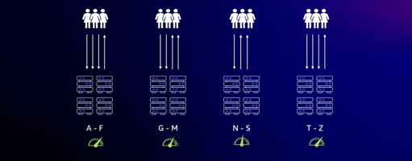
- But distribution differs by characters -> hotspot occurs 

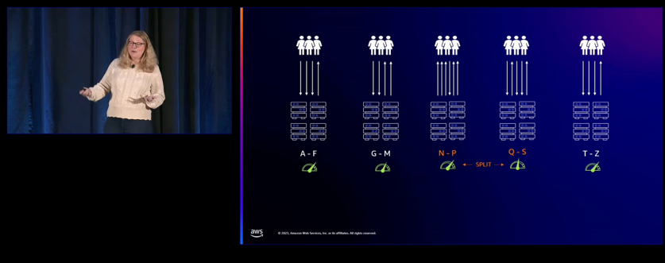
- S3 make use of prefix(any string of characters after the bucket name) to partition data 

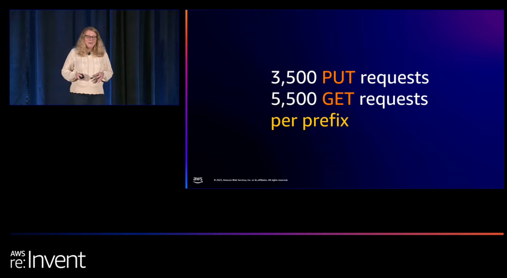
- If exceeded, 503 is returned

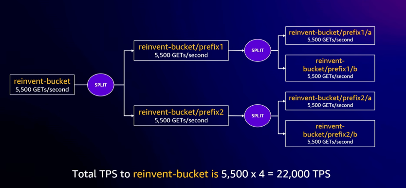
- You can split the prefix the scale 

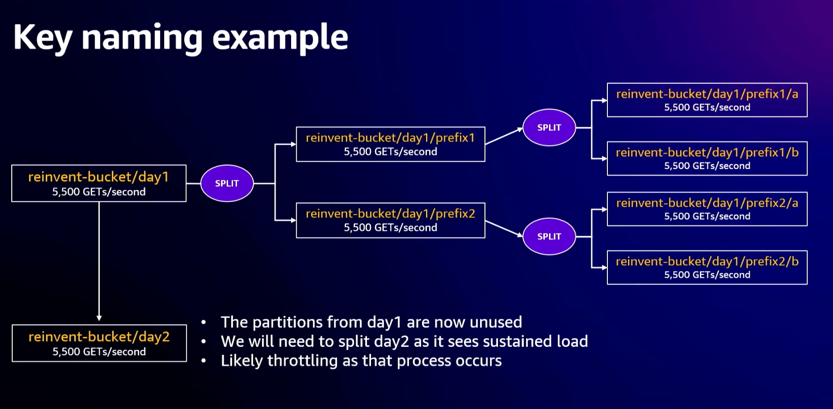
- Bad key naming strategy as day2 can't leverage split on day1

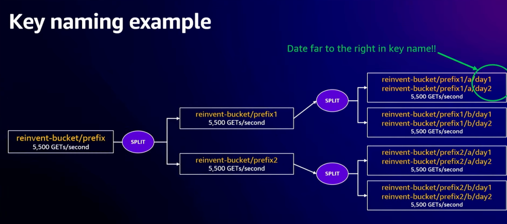
=> better key naming 

### Storage 

- Millions of hard drives 
- Achieving 11 9s of durability
  - end-to-end integrity checking of requests
    - 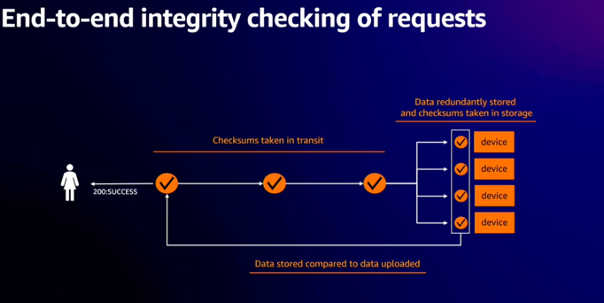
      - checksums 
    - 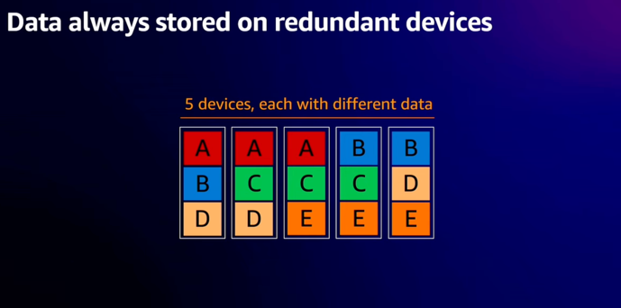
      - erasure encoding 
      - monitors for corruption, replicate when detecting corruption
  - 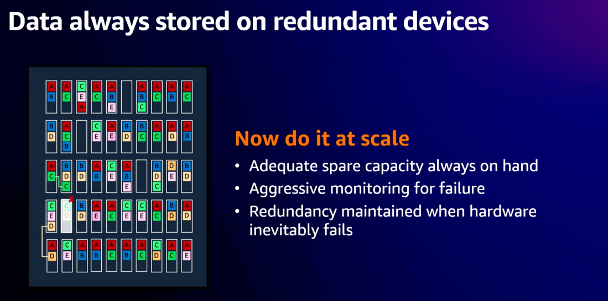
    - data always stored on redundant devices  
  - periodic durability auditing for data at rest

### AZ loss 

- Multi-AZ by default 
