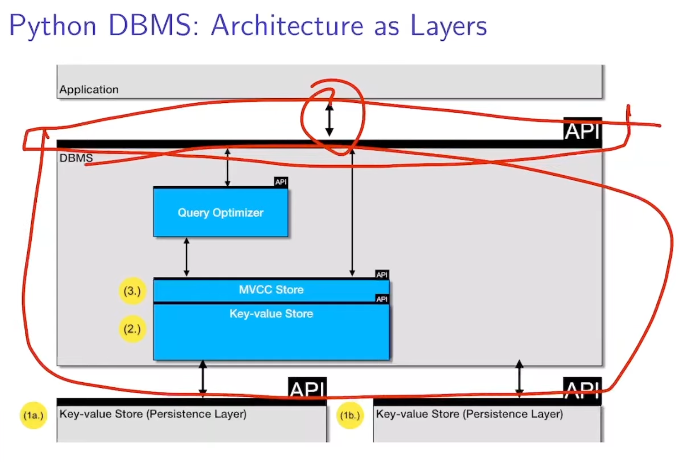

# [The Architecture of a DBMS](https://www.youtube.com/watch?v=dz_42FSs7x4&list=WL&index=6)

Why even worry about Database Architecture

- We need a plan to write big software
- Good design -> easy to add features, each to change

## Myths

- Software design looks nice on paper, but doesn't really matter in software development
    - Data modeling and software design duality -> similar problems and similar solutions apply
    - Data model / Software architecture are crucial for maintainability, robustness, and overall impact on the
      system
    - Flaws in the data model / software design will spread and MULTIPLY throughout the code
    - Avoid compromising in data modeling / software design
    - Any ugliness in your data model / software design will spread and multiply throughout your code
- It is much more important to get the algorithms right than wasting time with useless design
    - Virtually every algorithms also comes with design aspects(e.g. the strategy design pattern)
    - Take every friction point in your design as an opportunity to improve your design
    - You may end up with a better, more general, more flexible, faster or new algorithm
    - Getting algorithms "right" is exactly about understanding their core properties and different aspects and
      how they interact with one another. SE is your friend here.
    - Premature optimization is the root of all evil.
    - If you jump too quickly into optimizing your algorithm(mixing in multiple abstraction layers), you will
      miss a lot of opportunities to come up with a better algorithm.
- It's much more important to get the physical structures right
    - The effects of using the latest super-duper index structure are overrated.
    - The same is true for data layouts (row VW column VW any other)
    - Most discussions on physical structures ignore that there is a trade: you may gain some performance but
      also introduce additional complexity
    - The cost of using certain data representations may differ a lot. e.g. uncompressed column layouts are
      relatively easy to implement, the same holds for lightweight compression techniques, but not for the
      latest SIMDfied, bit-fiddling C++ mgic 
- and more..

## Architecture as Layers 

- 
